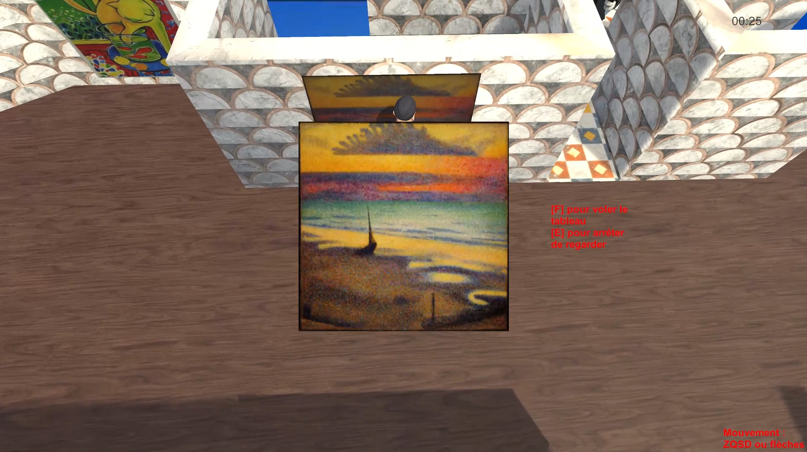

# PixelWeekEnd2022

## Description
Projet réalisé en 48H lors de la gamejam PixelWeekEnd 2022.  
Groupe de deux :  
Partie modélisation + texture + rig + animation -> Jérôme Béthery de La Brosse [Linkedin](https://www.linkedin.com/in/jerome-bethery-de-la-brosse/)

Vous êtes Lupain le plus grand fans de Matisse que la terre ait connue malheureusement, vous êtes pauvre.  
Une seule solution pour vous procurer ses oeuvres : les voler.  
Prenez garde aux faux tableaux ainsi qu’au terrible garde de nuit robotique.  

## Screen

